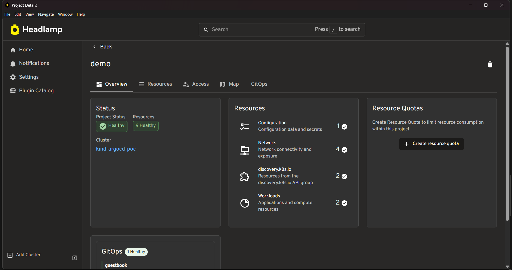
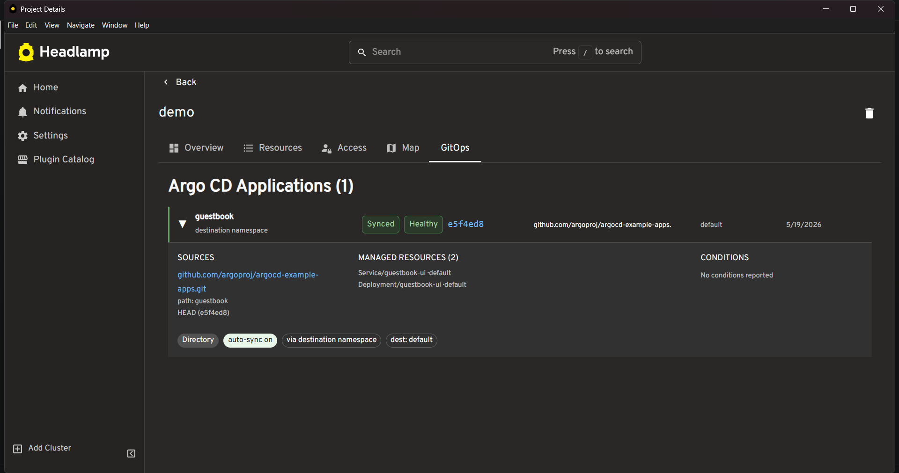
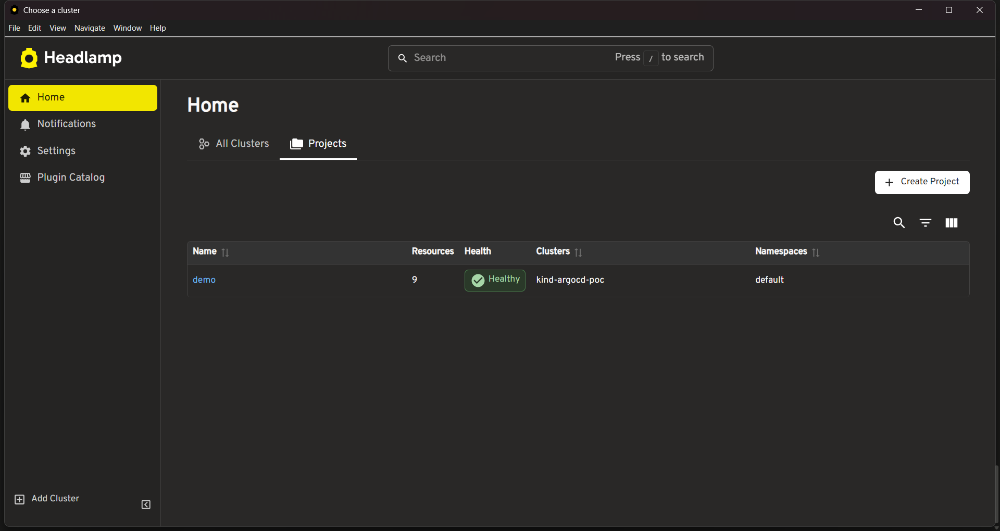

# headlamp-argocd

Headlamp plugin that brings Argo CD context into the Projects view.

If you use Argo CD to manage deployments, you've probably context-switched
between the Argo CD UI and whatever dashboard you use to check cluster health.
This plugin closes that gap. Sync status, health, revision, and source info
show up directly on the Headlamp project page.

Built as a proof of concept for my LFX Mentorship 2026 Term 2 application:
[kubernetes-sigs/headlamp#5260](https://github.com/kubernetes-sigs/headlamp/issues/5260)

---

## what it looks like

### project overview, gitops card
the card sits alongside the existing Status and Resources cards.
shows a one-line summary per app with sync/health badges and last sync date.



### gitops tab, full application table
click the GitOps tab on any project to see all matching Argo CD applications.
click a row to expand the detail drawer.



### projects list
the demo project showing kind-argocd-poc cluster, default namespace, 9 resources healthy.



---

## what it shows

**per application:**
- name and which namespace it lives in
- sync status (Synced / OutOfSync)
- health status (Healthy / Degraded / Progressing)
- short commit hash, linked to github/gitlab if possible
- source repository URL
- destination namespace
- last sync date

**in the detail drawer (click any row):**
- source repo, path, target revision
- managed resources list (Service, Deployment, etc.)
- any conditions or errors reported by Argo CD
- chips: source type, auto-sync on/off, how it matched, destination

---

## how it matches apps to projects

Headlamp projects group namespaces together. The plugin uses three layers
to figure out which Argo CD Applications belong to a project:

1. **destination namespace** - if `spec.destination.namespace` is one of the
   project's namespaces, it matches. this covers most setups.

2. **resource tracking label** - checks `app.kubernetes.io/instance` label,
   which Argo CD sets by default on managed resources.

3. **tracking annotation** - checks `argocd.argoproj.io/tracking-id` for clusters
   running in annotation or annotation+label tracking mode.

the match layer is shown in the detail drawer so you can see exactly why
an app was included.

---

## running it locally

you need: Node.js 20+, Docker Desktop, kind, kubectl, Headlamp desktop app.

```bash
# spin up a local cluster
kind create cluster --name argocd-poc

# install argo cd
kubectl create namespace argocd
kubectl apply -n argocd -f \
  https://raw.githubusercontent.com/argoproj/argo-cd/stable/manifests/install.yaml

# wait for pods
kubectl get pods -n argocd --watch

# label a namespace so headlamp treats it as a project
kubectl label namespace default headlamp.dev/project-id=demo

# deploy the sample guestbook app
kubectl apply -f examples/sample-app.yaml

# install deps and start the plugin dev server
npm install
npx headlamp-plugin start
```

then open Headlamp, connect to `kind-argocd-poc`, go to Home → Projects → demo.
you should see the GitOps card on the overview and the GitOps tab in the tabs row.

---

## project structure
src/
api/
types.ts          # typescript types for argo cd CRD fields
application.ts    # makeCustomResourceClass for Application + AppProject
hooks/
useProjectApps.ts # fetches apps and matches them to the current project
components/
StatusBadges.tsx          # Synced/Healthy/Degraded badges
EmptyState.tsx            # shown when argo cd is not installed or no apps match
GitOpsOverviewSection.tsx # the card on the project overview page
GitOpsTab.tsx             # the full tab with table and detail drawer
index.tsx           # registers the overview section and details tab
examples/
sample-app.yaml     # guestbook app for local testing

---

## scope

this POC demonstrates the plugin foundation. the full LFX project
(issue #5260) would extend this further with better multi-cluster support,
AppProject correlation, and integration with the upstream plugin registry.

---

## author

Nidhi Sharma · [@nidhi-9900](https://github.com/nidhi-9900)

## license

Apache 2.0